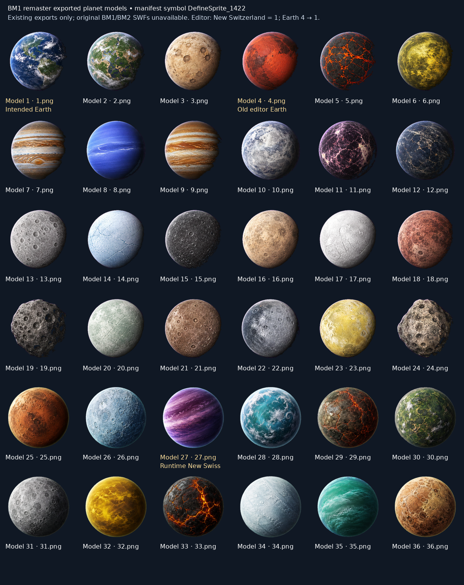

# Playtest fixes and faction world simulation

Review candidate for Artemis2028/BM1-remastered-work, based on the public debug-menu commit `28335fee1f2936b6ca720885afba3e609009e273`. This includes the previously accepted fleet work through `9ca4ddbcecb05496130ea1dac60f3faf2d8c489b`. No main-branch merge or remote push is part of this handoff.

## Status against the 15 September playtest notes

| Item | Candidate behavior |
| --- | --- |
| PT-01 | Crawl endpoint and duration use measured text height; resize and font loading remeasure it. Skip and reduced-motion reading remain available. |
| PT-02 | Earth editor model changes from 4 to 1, the existing New Switzerland editor image. Runtime Earth already uses 1. Source loading now precedes runtime manifest application. Existing-export contact sheet included; original BM1/BM2 SWF audit remains blocked by unavailable source files. |
| PT-03 | Removed the blanket Vex/Borg Romulan trade gate and literal “Interaction:” lore paragraphs. Vendor standing and exceptional stock rules remain. |
| PT-04 | Player-facing Terran Officer naming; saved faction identifier remains `terran`. |
| PT-05 | Distinct Tholian selection/profile/history copy grounded in the authored shipbuilding, funding collapse and Isaac trader background. |
| PT-06 | Local ownership or 100 standing as a member of the governing faction permits policy changes. Delegation controls access only; no installation ownership, weapons command, empire default or checkpoint anchor command. Lower standing or a governor change revokes delegation. |
| PT-07 | Individual cargo destination toggles, shared destination ring/count, saved visibility and usable uncharted destinations. Completed contracts no longer contribute markers. |
| PT-08 | Faction membership no longer grants local stations to the captain. Independent retaliation against the player does not classify that ship as an attacker of Terran authorities. Station target selection requires war, observed aggression, or an actual raid. |
| PT-09 | Persistent disabled-ship panel with recovery price, debt explanation, countdown, transfer/Fleet access and boarding status. Recovery restores mobility with partial hull, permits debt and charges once. |
| PT-10 | Starts, ordinary arrivals and wormhole arrivals use separated positions outside planets/stars/installations and active security perimeters. Existing saved flight positions and active checks are retained. Required clearance gates services before docking or ordinary hails. |
| PT-11 | Visible Comms control and system-wide station hails. Security/distress remain available when ordinary channels are blocked. Repair, refit, purchase and docking keep physical service constraints. |
| PT-12 | Local faction shops sell local/independent designs; independent authored markets and explicitly designated vendors retain their exceptions. Ship and plan standing follows the seller. Hull origin and pooled stock quantities remain distinct. |
| PT-13 | Orbital motion preserved. |
| PT-14 | Only Defense Platform 86 and Advanced Defense Platform 87 receive the modest damage adjustment. Durability, range and cadence are unchanged; platform projectiles can cover the stated engagement range. |
| PT-15 | Paid, persistent reconstruction orders create a new installation incarnation after seven construction days. Funds/materials, territory, site occupancy, ownership changes and destruction of construction are checked. Original ruins remain destroyed. Works while the player is elsewhere. |
| PT-16 | Saved quiet/patrol/scout/skirmish/raid/battle activity replaces the recurring automatic raid timer. Civilian density is independent. Active raid identity and damage survive reload; no reload reroll. |
| PT-17 | Planet-orbit rings place defenses/shipyards closer and larger installations farther out. Ring gaps account for both silhouettes. Player-built locations remain authored by their placement system. |
| PT-18 | Hidden Dominion core excluded from chart nodes, labels, nebulae, territory exclusions/shading, routes, bounds, click selection, keyboard neighbors and player pathfinding. Visiting the region unlocks it persistently. |
| PT-19 | Visible Menu with Resume, Save, Save/Exit, confirmed discard, settings and debug access. Menu/debug freeze simulation time. Escape works during warp. Save failure keeps the current run open; title closes gameplay surfaces and stops simulation. Alert posture is selectable without issuing attack orders. |
| PT-20 | New faction starts receive no territory or government stations. Older saves keep acquired holdings and offer an explicit starting-grant review instead of silently stripping property. |
| PT-21 | Public cheats menu retained and extended with crisis/war/peace controls and codes. |
| New request | Lore-weighted civilian traffic, separate wartime deployment weights, bilateral crises, escalation, mediation, war exhaustion and peace treaties. Changes persist and affect actual combat relationships and raid behavior. |

## World tuning for playtesting

These numbers are remaster tuning choices, not claims about original Flash behavior.

- Activity distribution per system per seven-day cycle: 40% quiet, 30% patrol, 15% scout, 8% skirmish, 5% raid, 2% battle. A scout appears after 60 local seconds; combat activities after 120/180/240 seconds. Combat deployments require a faction at war with the host. Activity triggers once per cycle, and elapsed time is saved.
- Civilians avoid enemy markets. Foreign-trade weights favor independents (1.8), Ferengi (1.5) and Tholians (0.8). Romulans are rare abroad (0.02), Breen similarly reclusive (0.03); local Romulan traffic remains normal. Military deployment is separate, and catalog regional restrictions still apply.
- Every three campaign days, one eligible faction pair may receive a seeded incident or diplomatic resolution. Territory-adjacent pairs and already-recorded pairs participate. Crisis starts at 70 tension; war at 100. Negotiated peace gives a 14-day treaty interval. War-exhaustion settlement starts after a minimum ten-day war. Multiday travel and daily advancement produce the same result.
- Borg, pirates and independent traffic do not enter diplomatic treaties. Player standing, ownership, explicit orders and recent local aggression remain separate from bilateral diplomacy.
- Reconstruction begins no earlier than the day after destruction when its owner can pay the existing station price and materials of `max(20, ceil(price/500))`. Construction takes seven days. Faction budgets start at 120,000 L/1,200 duranium, with bounded territorial income; private businesses use their own account and smaller installation income. Insolvent or occupied sites wait; construction losses do not refund or resurrect the project.

## Controls

Use **Menu** or **Escape** to pause. Use **Comms → Stations** for remote station channels. Active contract marker toggles are in Inventory. A disabled ship automatically shows its recovery panel.

Cheats & Debug includes selectors for two factions and a relationship state. Equivalent codes:

```text
standing romulan 100
crisis romulan klingon
war romulan klingon
peace romulan klingon
```

The Game menu and debug menu show recent galactic affairs. Peace ends faction hostility and orders an active bilateral raid to withdraw; recent personal attacks may still provoke local retaliation.

## Validation

Run with Playwright and an available Chromium installation:

```sh
npm run test:world
npm run test:fleets
npm run test:ships
npm run test:playtest
npm run test:stations
npm run test:debug:ingame
npm run test:fleets:ingame
npm run build
```

`BM1_CHROMIUM_PATH` selects Chromium for the playtest, station and debug probes. `BM1_TEST_ROOT` can point these probes at `dist`; `BM1_TEST_OUTPUT` selects the screenshot directory. The handoff includes the launch preload used for the existing fleet probe in this environment. Test-only runtime exports are injected into HTTP responses, never shipped in the game.

Observed checks: 21 browser scenario groups, 91 live fleet checks, 31 fleet model checks, 11 catalog checks, six diplomacy model groups, public-debug regression and the release build. Probe results and screenshots are included with the handoff. Long campaign balance remains a human playtest concern; these checks establish behavior and persistence, not a claim of finished balance.

The fleet probe's fixtures were updated for the requested rules: it explicitly acquires its test shipyard, raises the vendor's standing, and calculates eligible authored stock with the new faction filter. No test groups were removed.

The live defense comparison used a tracked stationary Klingon target at 250 units, zero shields and ten seconds of Type X Phaser fire. Platform 86 delivered 1,012 damage before and 1,144 after (+13.0%, rounding included), with the same 457 ms cadence. Platform 87 damage changed 45→52 with its 1,171 ms cadence unchanged. All 34 other station defense profiles matched the baseline exactly. This is a controlled combat comparison, not a fleet-battle balance claim.

## Planet art trace and remaining source audit



| Surface | Editor data before | Editor data now | Runtime manifest | Export |
| --- | --- | --- | --- | --- |
| Earth | 4 | 1 | 1 | assets/game/planet-models/1.png |
| New Switzerland | 1 | 1 | 27 | Editor 1.png; runtime 27.png |

The contact sheet contains the repository's 36 existing exported PNGs. Its manifest lists `DefineSprite_1422`, but labels its source only as “clean mod manifest.” That metadata cannot establish which original BM1/BM2 SWF supplied each image. Original `.swf`/`.fla` files were absent from the checked-out repository and available supplied files. No original Flash extraction or source-game attribution is claimed. The outstanding part of PT-02 requires those originals.
